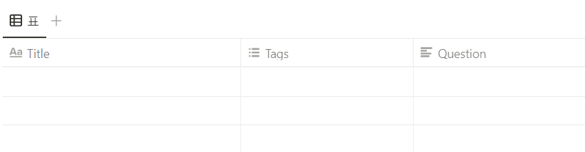
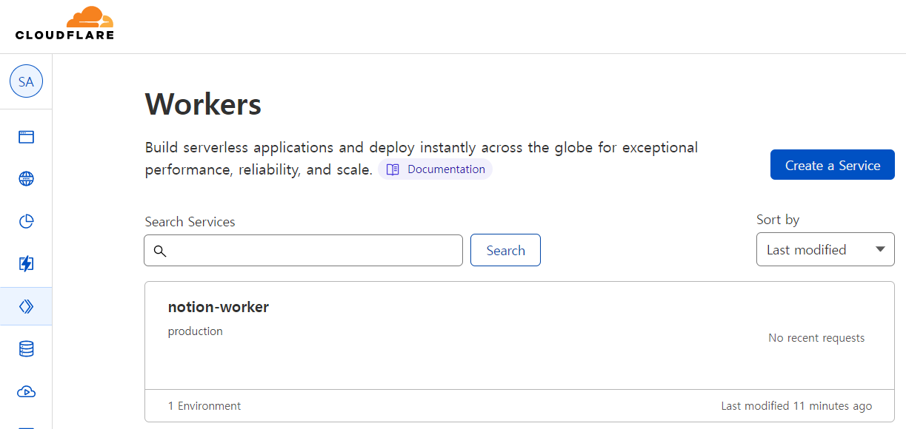
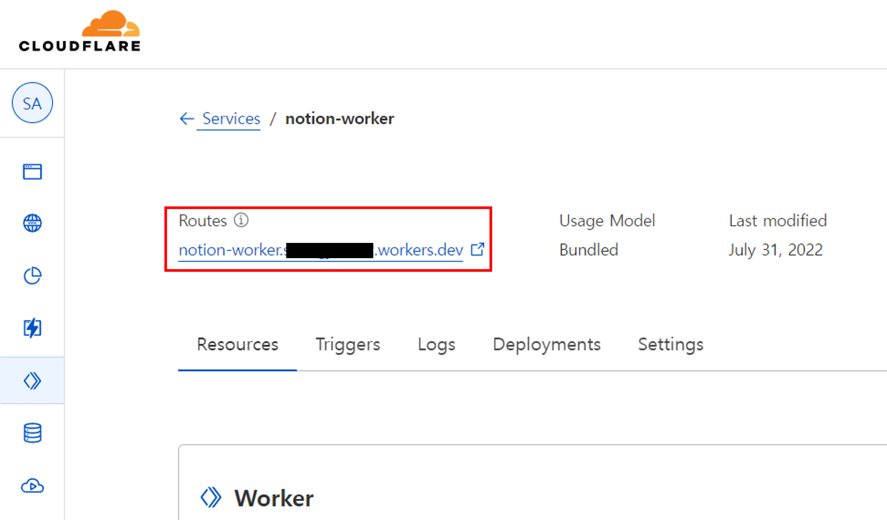
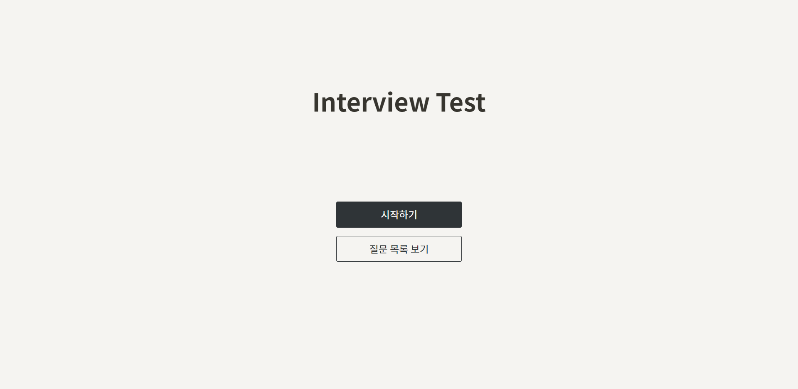
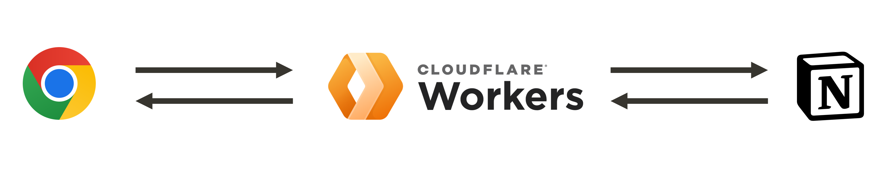
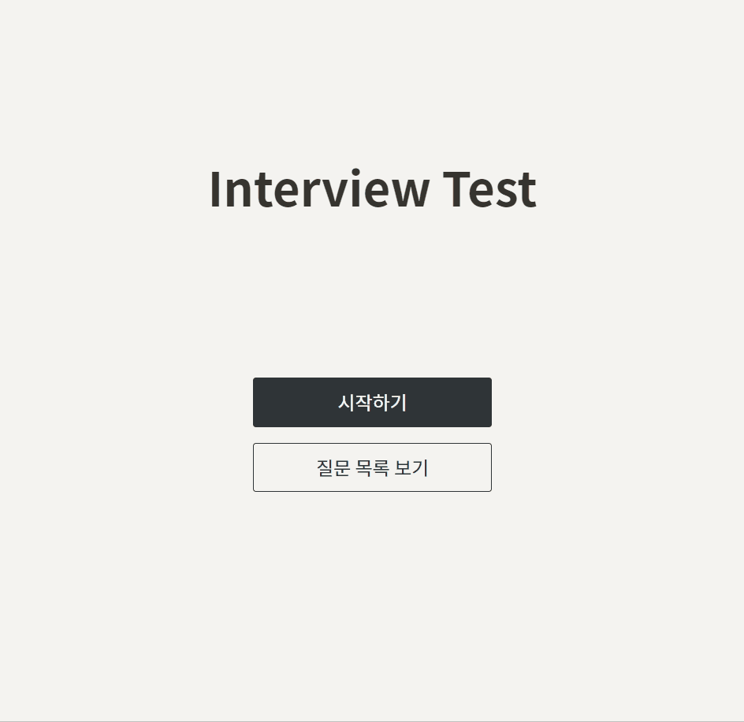
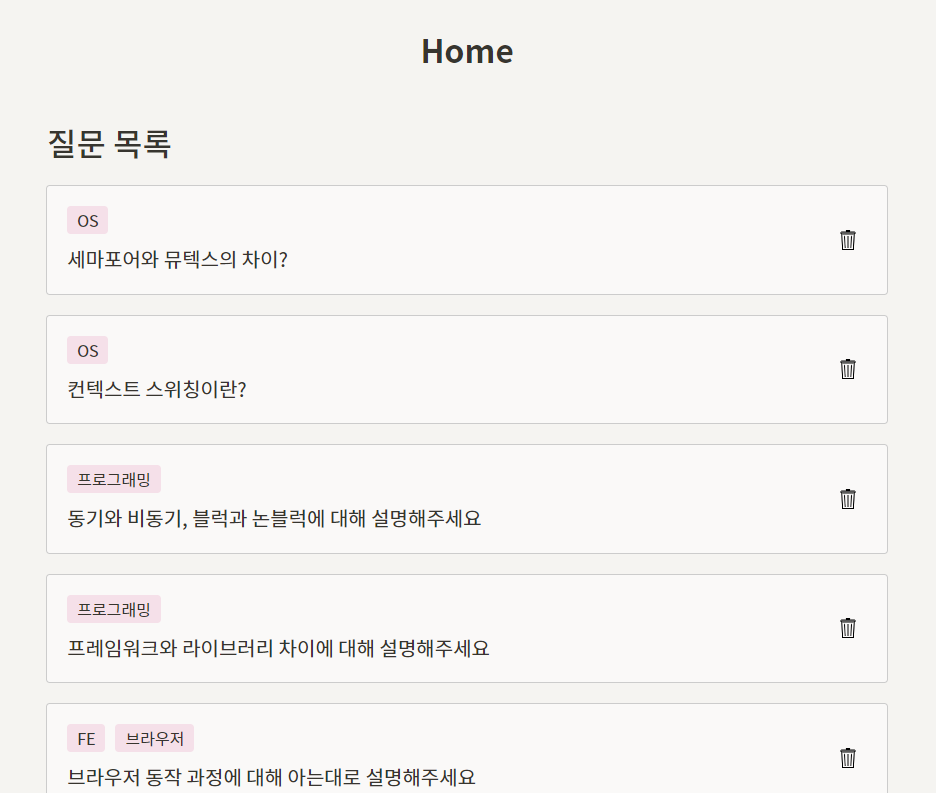
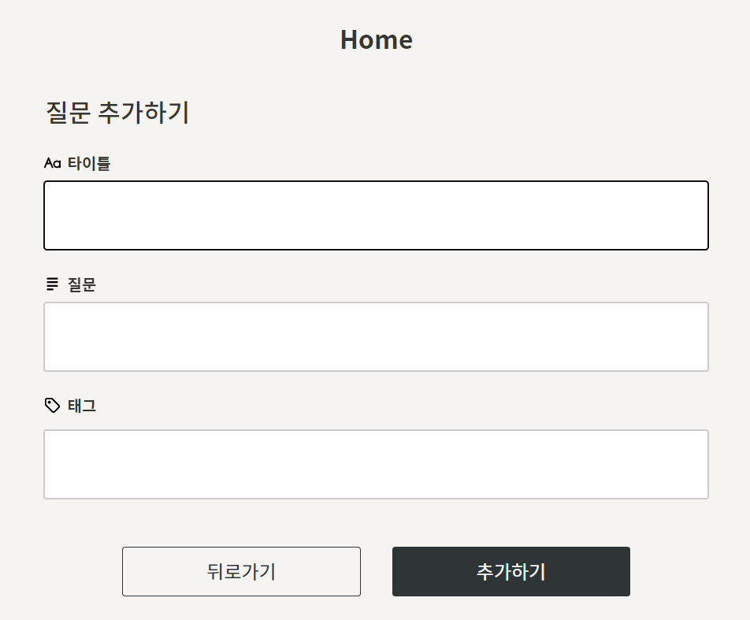
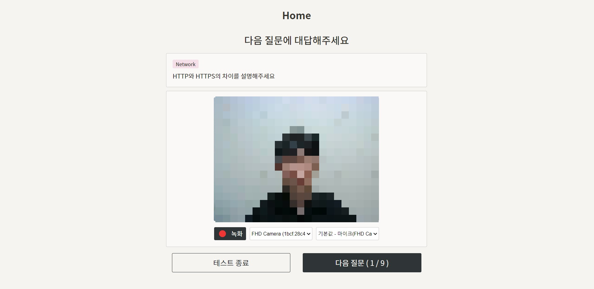

# Interview Test :man_office_worker:

## 소개

스스로 준비한 질문을 대답해보는 연습을 위한 면접 연습 서비스입니다.

### 기능 ✨

- 질문 작성, 목록 확인
- 면접 연습 영상 녹화 및 다운로드


## Getting Started :fist_oncoming:

> 어플리케이션을 이용하기 위해 [Cloudflare Worker](https://workers.cloudflare.com/) 계정과 [Notion](https://www.notion.so/) 페이지, [Notion API KEY](https://developers.notion.com/)가 필요합니다.

### 1. 프로젝트 다운로드

- 프로젝트를 ZIP파일로 다운로드받거나 git clone 받습니다.


### 2. Notion 준비하기

- 먼저 https://www.notion.so/my-integrations 에서 API integration을 만듭니다.
- 새로 만든 API integration에서 **Notion API 토큰**을 얻을 수 있습니다.

- 어플리케이션의 Database가 될 Notion database를 만듭니다.
- Database 페이지의 url에서 해당 Database의 **Database ID**를 얻을 수 있습니다.
  - `https://www.notion.so/<DATABASE_ID>?v=<...>`

- Database 페이지의 오른쪽 상단 공유 버튼을 누르고, 위에서 만든 API integration을 추가합니다.

- 어플리케이션의 Database에 필요한 컬럼은 `Title`, `Tags`, `Question` 입니다. 아래에 맞게 컬럼을 수정해줍니다.

  - `Title` : 제목 속성
  - `Tags` : 다중 선택 속성
  - `Question` : 텍스트 속성

  


### 3. Worker 만들기

- 프로젝트 루트 경로에서 터미널 창을 엽니다.

- 먼저 `wrangler`라는 Workers CLI를 설치합니다.

  ```bash
  $ npm install -g wrangler
  ```

- 그리고 로그인해줍니다.

  ```bash
  $ wrangler login
  ```

  명령어를 입력하면 웹페이지가 열리고 로그인을 할 수 있습니다.

- `프로젝트 루트/worker` 폴더로 이동한 뒤 npm install을 해주고 `wrangler.toml` 파일을 생성합니다.

  ```bash
  $ cd worker/src
  
  $ npm install
  
  $ touch wrangler.toml
  ```

- 생성한 `wrangler.toml`에 다음과 같이 입력합니다.

  `<Database ID>`에 위에서 얻은 Notion **Database ID**를 입력합니다.

  ```bash
  name = "notion-worker"
  main = "src/index.ts"
  compatibility_date = "<오늘 날짜>"
  
  [vars]
  DATABASE_ID = "<Database ID>"

- API KEY는 비밀 입력을 해줍니다.

  ```bash
  $ wrangler secret put NOTION_API_KEY
  ```

  `Enter a secret value: ` 라는 값을 입력하라는 창이 나오면, 위에서 얻은 **Notion API 토큰**값을 입력해줍니다.

- wrangler publish를 진행합니다.

  ```bash
  $ wrangler publish
  ```

  publish가 끝나면 자신의 Workers 대시보드에 notion-worker라는 Worker가 생긴 걸 확인할 수 있습니다.

  


### 4. Frontend 실행하기

- `프로젝트 루트/frontend` 로 이동합니다.

  ```bash
  $ cd ../frontend
  ```

- npm install을 통해 필요한 패키지를 다운로드받습니다.

  ```bash
  $ npm install
  ```

- 환경 변수 지정을 위한 `.env` 파일을 생성합니다.

  ```bash
  $ touch .env
  ```

- 생성한 `.env` 파일에 다음과 같이 작성합니다.

  ```
  REACT_APP_WORKER_URL="https://notion-worker.<Cloudflare worker ID>.workers.dev/"
  ```

  작성하는 URL은 자신의 Cloudflare Worker에서도 확인할 수 있습니다.

  

- `npm start` 로 실행합니다.

  ```bash
  $ npm start
  ```

  


## 기술 🛠

   




## 서비스 화면 :computer:



### **메인 페이지**


- "시작하기" 버튼을 눌러 테스트를 시작할 수 있습니다.
- "질문 목록 보기" 버튼을 눌러 자신이 저장한 질문 목록을 확인할 수 있습니다.


### **질문 목록 페이지**



- 자신의 Notion에 저장한 질문 목록을 확인할 수 있습니다.
- 휴지통 아이콘을 클릭해 질문을 삭제할 수 있습니다.


### **질문 추가 페이지**



- 새로운 질문을 작성할 수 있습니다. 작성한 내용은 Notion에 저장됩니다.
- 태그 인풋에서 엔터를 누르면 태그가 입력됩니다.
- 태그에 마우스를 올린 후 X버튼을 누르면 입력한 태그를 삭제할 수 있습니다.


### **테스트 페이지**



- 자신이 작성한 질문 중 무작위로 질문이 화면에 나타납니다.
- 자신이 답변하는 모습을 녹화한 뒤 저장할 수 있습니다.